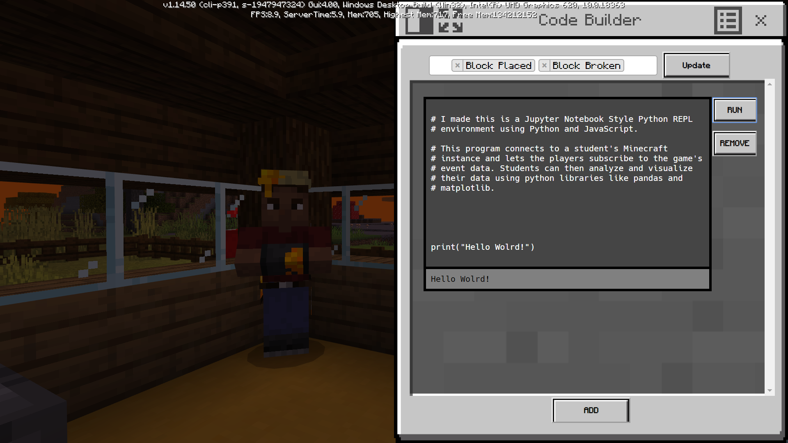

<p align="center">
  <a href="https://github.com/ctakasakaubc/Minecraft_A-Minecraft_AI_Capstone">
    
  </a>
  <h3 align="center">User-guided data collection, and Data Science Exploration in Minecraft: Education Edition</h3>
</p>

---



_Integrate Data Science Lessons Directly Into MEE_

## Quick Start

**❗️Important**: Python 2 is not supported

Install [Python 3.9](https://www.python.org/downloads/)

Install Flask, and several data science libraries with "pip"

```bash
pip install flask websockets jsonlines 
pip install numpy matplotlib pandas sklearn
```

This application is made to introduce students to datascience concepts. While these concepts are more suitable for upper middle-school ages and higschool ages, sufficiently computer literate students will be able to work with the application and begin to understand many fundamental ideas. 

Learn how to collect data, and use it to enhance your gameplay!

## Features:

- 📁 __Minecraft event data collection__: Collects data as users play, tracking events such as breaking a wood block, or throwing a piece of cobblestone.
  
- 📑 __Data Importing__: A simple function allows users to load all of their event data into a built-in Python environment.
  
- 🐍 __Python REPL Environment__: A built-in REPL environment allows users to immediately work with their data after collectiong it, right inside of Minecraft!
  
- 📈 __Python Data Science Libraries__: Preloaded Python libraries allow users easily visualize and sort their data, as well as train sophisticated models.

## Lesson Plans

Lessons are written as default Markdown ( .md ) files. What this means is that you can write an entire lesson in Markdown (or Word / some other word processor, then convert), as if you were going to give users a normal handout for an assignment.

### Example Lesson Plan

```markdown
# Determine Optimal Mining Level with "Hierarchical Clustering"

## What You'll Need:

- A mine
- A pick
- 25 minutes

## Data Collection

To create this model, you need to mine some ores! Included with this lesson is some mining data collected by fellow Steves from around the world!

Begin by collecting some data of your own by going into a mine and collecting some coal, iron, gold, and redstone! If you can, mine yourself some diamonds too!

## Creating the Model

Lorem ipsum.. just kidding. Something about how hierarchical clustering is like a tree. 
It helps visualize how different or similar data is and how we should separate it into groups. 
This model will tell us exactly how it tells the ores apart (other than by name) so we can then use that logic in-game!

Start by reading in your data:

`
# read in your newly collected data
my_data = update_event_data()

# see how many different types of blocks you mined, and which ones you want to keep
print(my_data...)
...
`
```

A [complete example lesson](lessons/example_lesson/example_lesson.md) is included in the repo [here](lessons/example_lesson/example_lesson.md)!

## Resources

- [Quick Markdown Reference](https://www.markdownguide.org/cheat-sheet/)

- [Minecraft: Education Edition](https://education.minecraft.net/)

- [Minecraft Wiki](https://minecraft.fandom.com/wiki/Minecraft_Wiki) - All information may not pertain to "Education Edition"
