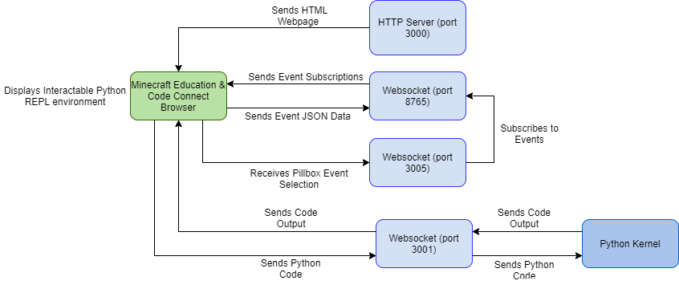

# Python Backend Documentation

## Structure

### Overview

Using the built-in multiprocessing library,
an HTTP server is hosted on Port 3000. This
server sends the Code Connect Browser the HTML
of our webpage. 

Code blocks, when run, send their python code over
port 3001. This gets forwarded to our python kernel.
The python kernel output is sent back as a reply.

The pillbox for selecting events to subscribe to sends
a list to python over port 3005. This selection is then
processed and sent over the websocket connection made with
Minecraft Education (port 8765).

## main

Starts a subprocess that runs a local http server on port 3000

Using asyncio, websockets on ports 3001, 3005, and 8765
listen to their respective events concurrently.

`receive_code` uses websocket on Port 3001: 

 - Receives Python Code from coding cells
  
 - Sends output of said python code back over the
socket to JavaScript to display the output. 

`subscribe_to_event_list` uses websockets on Ports 3005 
and 8765: 

 - Receives comma separated list of
events from JavaScript Pillbox

`connect_minecraft` uses websocket on Port 8765:

 - Requires player to first use '/connect localhost:8765'
to connect to the app to Minecraft

 - Creates a global websocket so 
  `subscribe_to_event_list` can change what events are subscribed to without having the player reconnect

 - Receives event data from Minecraft

## serve

`run_server`
 - Creates an HTTP Server for our Python REPL environment on port 3000
 - We will be moving to a flask server

